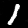
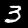
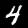
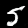
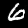
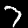
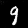

## Sobre o Projeto

Este projeto teve como objetivo gerar imagens sintéticas de dígitos manuscritos utilizando uma cDCGAN (Conditional Deep Convolutional Generative Adversarial Network) treinada com o dataset MNIST.

A cDCGAN é uma variação das GANs tradicionais que permite controlar a classe da imagem gerada, ou seja, o modelo não cria dígitos aleatórios, mas pode gerar, por exemplo, especificamente o número 3, 7 ou 9, de acordo com o rótulo fornecido como condição.

## Arquitetura

A arquitetura baseada em cDCGAN (Conditional Deep Convolutional GAN) foi escolhida por oferecer um equilíbrio adequado entre capacidade de geração, controle sobre as classes e simplicidade computacional, sendo compatível com a complexidade do problema proposto.

O dataset MNIST é composto por imagens de baixa resolução, em escala de cinza, com variação visual relativamente limitada quando comparado a datasets como Imaginet. Em outras palavras, os dígitos apresentam estruturas simples, fundo uniforme e pouca diversidade de textura. Dessa forma, não é necessário utilizar arquiteturas muito profundas ou modelos altamente sofisticados para capturar os padrões relevantes dos dados.

A utilização de camadas convolucionais (DCGAN) é suficiente para extrair e modelar as características espaciais dos dígitos, como bordas, curvas e espessura dos traços. Além disso:

* A condicionalidade (cGAN) foi incorporada para permitir o controle da classe do dígito gerado, o que é essencial para demonstrar geração direcionada (por rótulo) sem aumentar significativamente a complexidade do modelo.

* O uso de estruturas clássicas de DCGAN (convoluções no discriminador e convoluções transpostas no gerador) já é amplamente validado na literatura para tarefas de geração de imagens simples, como MNIST, uma vez que consegue capturar as relações espaciais necessárias para uma boa qualidade das imagens geradas.

## Ambiente e Ferramentas

O projeto foi implementado em **PyTorch**, utilizado para definir as arquiteturas do gerador e do discriminador, realizar operações com tensores e executar o processo de treinamento da cDCGAN. A biblioteca **Matplotlib** foi empregada para a exibição das imagens geradas durante o treinamento, permitindo a inspeção visual dos resultados. O **Google Colab** foi utilizado como ambiente de execução em nuvem, onde o modelo foi treinado com uso de GPU e integrado ao Google Drive para armazenamento do dataset e dos resultados.

## Treinamento

O treinamento  dos modelos foi realizado no notebook do Google Colab _train_cgan_mnist.ipynb_. Para treinar, basta redefinir as constantes do Google Drive (mnist_path, epoch_samples_dir, checkpoints_dir, models_dir) e em seguida executar as células do notebook em ordem sequencial.

## Inferência

Para rodar a inferência basta instalar as dependências do _requirements.txt_ e rodar o comando de referência a seguir:

```
python3 inference.py --model models/best_cgan_minist.pt --digit 9 --outdir digit_samples --samples 3
```

## Métricas Utilizadas

Para avaliar o modelo Generator resultante, foram utilizadas as métricas Fréchet Inception Distance (FID) e Inception Score (IS). 

O **FID** é uma das métricas mais utilizadas para avaliar o desempenho de modelos generativos de imagens. Ele quantifica a diferença entre as distribuições de features extraídas de imagens reais e de imagens geradas, utilizando uma rede Inception pré-treinada. Essa comparação é feita a partir da média e da covariância dessas representações, permitindo analisar ao mesmo tempo o **realismo** e a **diversidade** das amostras sintéticas. Valores menores de FID indicam que as imagens geradas apresentam estatísticas mais próximas das imagens reais, refletindo melhor qualidade do modelo generativo.

O **Inception Score (IS)** avalia simultaneamente a **qualidade** e a **diversidade** das imagens geradas com base nas probabilidades de classificação fornecidas por uma rede Inception; valores maiores indicam imagens mais nítidas e variadas, mas a métrica **não compara diretamente com dados reais**.

Após o treinamento de 80 épocas, os seguintes resultados foram obtidos para as métricas acima: 

| Métrica | Valor | Conclusão do Resultado*  |
| ------- | ----- | ------------------------ |
| FID             | 8,36     | Ótimo       |
| Inception Score | 1,04     | A melhorar  |

*A conclusão do resultado foi feita com base nos valores esperados na literatura.

## Resultados

O Gif a seguir mostra a evolução das imagens geradas pelo Generator no decorrer das épocas:

<p align="center">
    
</p>

Já o conjunto de imagens a seguir mostra as predições da melhor versão do Generator treinado:

<p align="center">
    
    
    
    
    
    
    
    
    
    
</p>